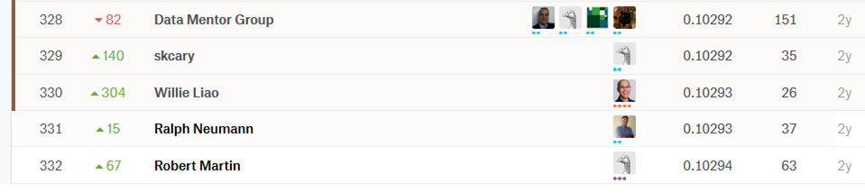

# Udacity MAND 毕业项目开题报告

谢伟 
2018年3月14日

# Rossmann商店销量预测

## **项目背景**
销售预测对其企业降低库存，提高仓库周转率，合理安排资金，降低运营成本有着重要的意义。 
Rossmann在7个欧洲国家经营着3000多家药店。目前，Rossmann门店经理的任务是提前6周预测他们的日销量。商店的销售受到许多因素的影响，包括促销、竞争、学校和州假日、季节性和地点。由于成千上万的个人经理根据他们独特的情况预测销售，结果的准确性可能会非常不同。 
可靠的销售预测使商店经理能够制定有效的员工时间表，提高工作效率和积极性。通过帮助Rossmann创建一个健壮的预测模型，您将帮助商店经理专注于对他们来说最重要的事情:他们的客户和他们的团队!

## **问题描述**
根据Rossmann给出的历史销售数据，包括商店信息，竞争对手信息，促销信息，是否假期等，预测他们的日销量。
## **数据集**
* 文件 
    - train.csv - 包含销售信息的历史数据，用于模型训练 
    - test.csv - 不包含销售信息的历史数据，用于模型测试 
    - store.csv - 有关商店的补充信息
* 数据描述
    - Id - 测试集中表示商店信息的id
    - store - 每个商店的唯一id
    - Sales - 指定日期的销售额
    - Customers - 指定日期中的顾客数量
    - Open - 商店是否营业，0=不营业，1=营业
    - StateHoliday - 是否为国家法定假期， a=公共假期， b=东部假期， c=圣诞节， 0=不是假期
    - SchoolHoliday - 附近的学校是否对商店有影响
    - StoreType - 一共有四种商店类型，分别是a，b，c，d
    - Assortment - 描述分类水平，包括a = basic, b = extra, c = extended
    - CompetitionDistance - 附近最近竞争对手商店的距离
    - CompetitionOpenSince[Month/Year] - 附近最近竞争对手的开业时间
    - Promo - 在给定日期中，商店是否有促销
    - Promo2 - 是否参与连续促销活动。0：没有参与，1：参与
    - Promo2Since[Year/Week] - 连续促销活动开始的时间
    - PromoInterval - 每轮连续促销活动开始的时间，比如"Feb,May,Aug,Nov"表示每一轮连续促销开始的时间是"Feb，May，Aug，Nov"

## **解决方案**
对销售额的预测，属于监督学习中的回归问题。因此需要建立回归模型，对销售额进行预测。 
在监督学习中，有多种适用于回归的模型。在这个项目中将探索如下模型：
* Linear regression
* Lasso
* Ridge
* Elastic Net
* Xgboost
* lightgbm
* stacking

因为Kaggle每天只有5次的提交机会，为了保证提交的有效性，需要在本地对"train.csv"进行划分，划分为训练集和验证集。训练集用来对模型进行训练，验证集在本地对模型进行验证，已保证模型对未知数据的效果。
## **基准模型**
在Kaggle的这个竞赛中，一共是3303个参赛者（队）提交，目标是进入前10%，对比Kaggle的Public Leaderboard，Public Leaderboard成绩不高于0.10294即可进入前10%的排名。

因此基准模型选为0.10294。
## **评估指标**
这是一个回归预测问题，其评价指标是 RMSE（Root Mean Square error，均方根误差），它是预测值与实际值偏差的平方和除以样本数量n的平方根，公式如下

$$RMSE=\sqrt{\frac{1}{n}\sum_{i=1}^{n}{(\frac{y_i - \hat{y_i}}{y_i})^2}}$$

RMSE是平方误差平均值的平方根。每个误差对RMSE的影响与平方误差的大小成正比，因此，较大的错误对RMSE产生了不成比例的巨大影响。正是因为这样，RMSE对异常值非常敏感[[1]](#1)，所以它能够很好地反映出模型预测的精密度。对于项目中需要预测的销售量，采用 RMSE 能够很好地表示模型的效果。
## **项目设计**
### 语言和工具
在项目中会用到的工具和库包括
* Python 3.6
* jupyter notebook
* Scikit-learn 0.19.1
* Pandas 0.22.0
* NumPy 1.14.0
* Scipy 1.0.0
* Seaborn 0.8.1
* Matplotlib 2.2.0
* Xgboost 0.17.0
* lightgbm 2.1.0
* mlxtend 0.11.0
### **数据**
项目中将完全使用Kaggle提供的数据集，包括train.csv，test.csv，store.csv
### **项目流程**
1. 结合train.csv和store.csv，对数据进行可视化探索分析，确定后续特征工程的目标和重点
2. 数据预处理，包括连续变量和分类变量的处理
3. 特征工程，包括特征转化，新特征的生成
4. 特征选择
5. 模型的比较。根据评价指标，比较多种模型的性能
6. 调参。根据第五步的结果，对模型进行超参数的调节和优化
7. 结果的比较。将得到的结果和基准目标进行比较。

机器学习的每个步骤不是独立存在的，因此在以上的工作流程中，会根据实际得到的结果，进行迭代循环，使预测精度不断提高。

## **参考文献**
1.  [Root-mean-square deviation](https://en.wikipedia.org/wiki/Root-mean-square_deviation)

